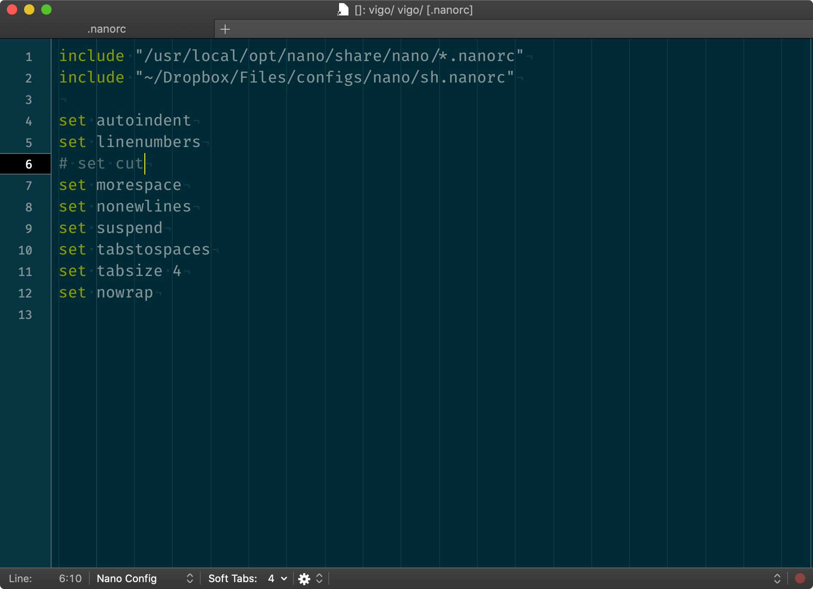

# `nanorc` Config Bundle for TextMate

Little helper / syntax highlighter for GNU `nano`.



## Install

```bash
$ cd "${HOME}/Library/Application Support/TextMate/Bundles/"

# if you don’t have Bundles folder;
# $ mkdir "${HOME}/Library/Application Support/TextMate/Bundles"
#

$ git clone https://github.com/vigo/textmate-nanorc.tmbundle.git
```

Now restart your TextMate!

```bash
$ mate ~/.nanorc
```
